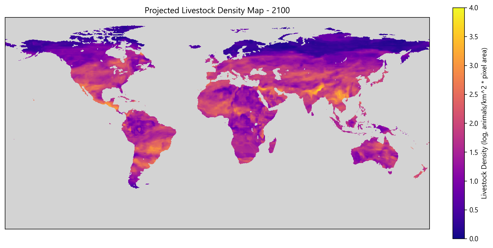

# cattlelogue
*Modeling climate-driven shifts in livestock distribution using machine learning*



Climate change is expected to significantly impact livestock distribution, with potential consequences for food security and ecosystem health. Current livestock distribution models are sparse due to the complexity of ecological and climatic interactions, and tend to rely on expert systems and simulations of feedback loops. Instead, we propose a machine learning approach to predict livestock distribution shifts under various climate scenarios. Our model is a proof-of-concept that uses historical livestock data and climate variables to train a neural network that can project future distributions. We hope that the speed at which such models can be built will allow for faster action on climate change mitigation and adaptation strategies, or to help inform areas of interest for further research.

## Usage
Training
```bash
python -m cattlelogue.train [OPTIONS]

  Train a livestock density prediction model using AdaBoost with Random Forest
  as the base estimator.

Options:
  --test_size FLOAT       Proportion of data to use for testing
  --n_estimators INTEGER  Number of estimators for AdaBoost
  --output TEXT           Output model file
  --help                  Show this message and exit.
```
Inference and visualization
```bash
python -m cattlelogue.visual [OPTIONS]

  Visualize livestock density predictions for a given year using a trained
  random forest model.

Options:
  --model_path TEXT   Path to the trained model
  --year INTEGER      Year for which to generate predictions
  --use_cached        Use cached predictions if available
  --save_predictions  Save predictions to a file
  --output TEXT       Output file for the prediction visualization
  --help              Show this message and exit.
```

## Dependency Installation

```bash
pip install -r requirements.txt
```
This project uses Google Earth Engine for dataset access and processing. You will need to authenticate your Google account to use it. Follow the instructions in the [Google Earth Engine documentation](https://developers.google.com/earth-engine/guides/python_install) to set up your environment.

<hr>

